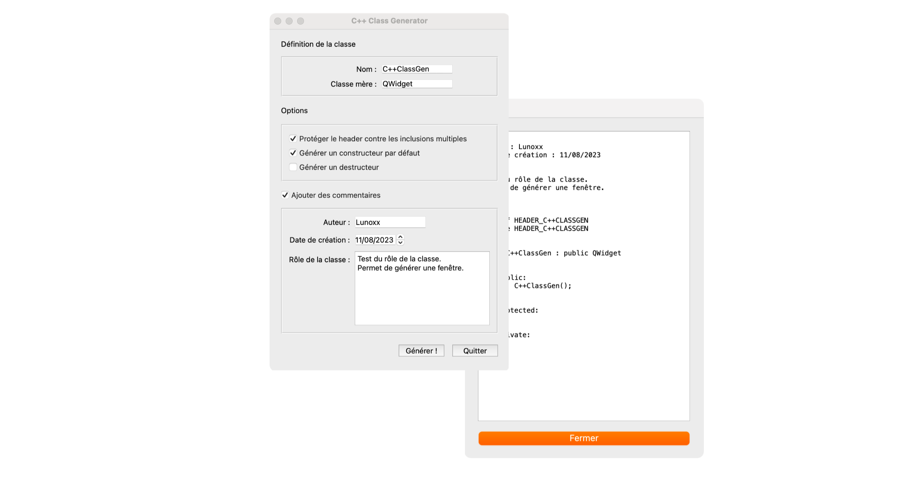
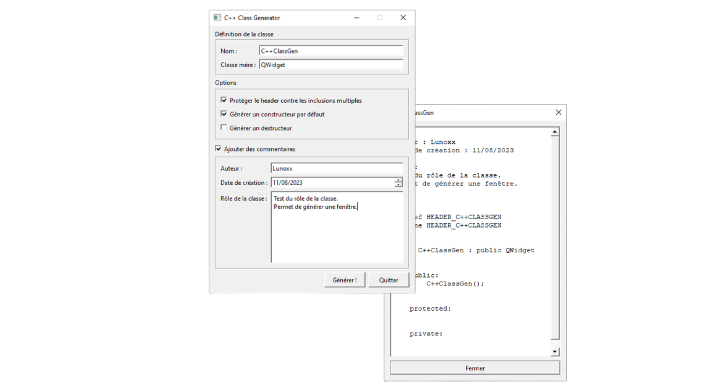

# CPPClassGenerator

🇫🇷 Français
Voici un petit outil permettant de générer une classe C++ automatiquement.

**Conseils** :
Ceci a été réalisé avec la librairie Qt 6.5.2.
Il vous faudra donc la télécharger et modifier le fichier CMakeLists.txt en fonction d'où se trouve la librairie.

🇬🇧 English
Here is a small tool that allows generating a C++ class automatically.

**Tips**:
This has been developed using the Qt 6.5.2 library.
So, you will need to download it and modify the CMakeLists.txt file accordingly based on the location of the library.

**Preview for macOS**

**Preview for Windows**

